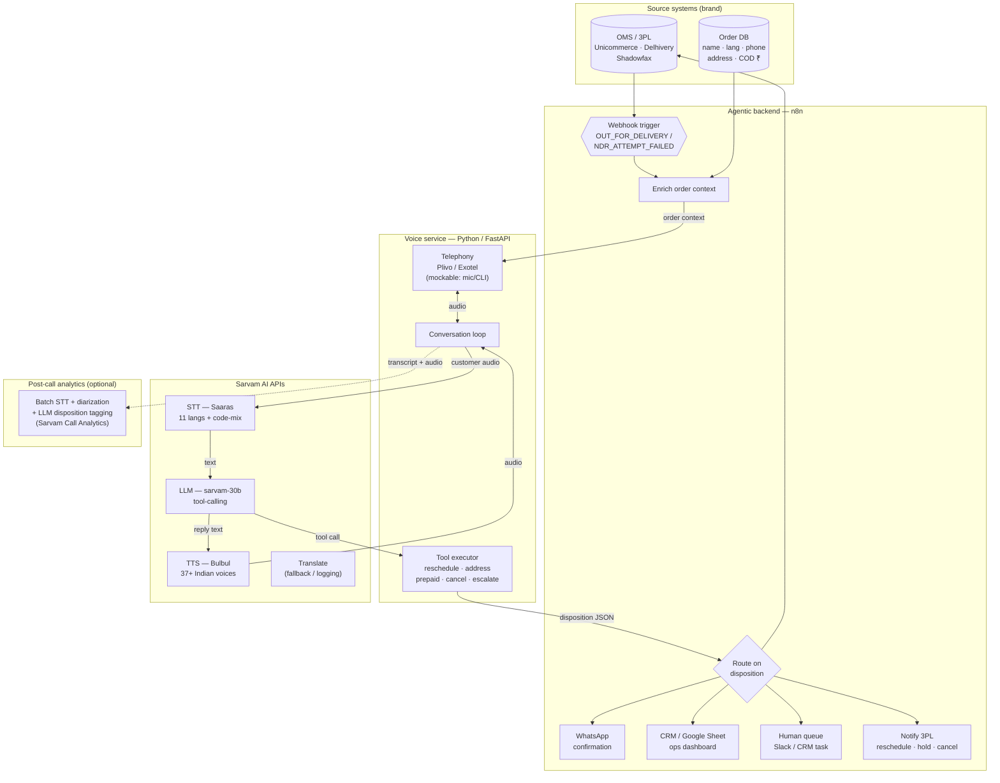

# Project Sampark — Architecture

A required deliverable: system diagram showing all components, APIs, and data flows.
Rendered with Mermaid (GitHub renders this natively). A PNG export lives in `docs/assets/`.

---

## System diagram

---

## Data flow, in words

1. **Trigger** — the brand's OMS/3PL fires a webhook into n8n when an order goes *Out for
   Delivery* or a delivery attempt fails (NDR).
2. **Enrich** — n8n joins the order id against the order DB to assemble call context: customer
   name, **language preference**, phone, address, COD amount, attempt number.
3. **Dial** — n8n calls the Python voice service, which places an outbound call (telephony
   provider, or mic/CLI in the PoC).
4. **Converse** — the conversation loop streams customer audio to **Sarvam Saaras (STT)**, sends
   the text + system goal + tools to **sarvam-30b (LLM)**, and speaks the reply via **Sarvam Bulbul
   (TTS)** — all in the customer's language.
5. **Act** — when the model decides a resolution, it emits a **tool call**; the tool executor runs
   it and the agent confirms verbally.
6. **Fan-out** — the structured disposition returns to n8n, which conditionally updates the OMS,
   instructs the 3PL, sends a WhatsApp confirmation, logs to CRM/Sheet, and escalates ambiguous
   calls to a human.
7. **Analytics (optional)** — the call audio + transcript feed a batch STT + diarization + LLM
   pipeline that tags disposition and surfaces objection patterns for ops.

---

## Two voice implementations

The **Voice service** above is turn-based (record → Saaras → sarvam-30b → Bulbul), which is ideal
for the dashboard and the n8n-triggered pipeline. Sampark also ships a **real-time, streaming
variant** in `realtime/` — built on **Pipecat + Sarvam** over WebRTC — where Saaras STT and Bulbul
TTS stream continuously and the caller can **interrupt mid-sentence (barge-in)**, exactly like a
live phone call. Same brain (`sarvam-30b`), same four RTO resolutions; the streaming path is what
the live **Call Console** demo uses.

---

## Which Sarvam APIs and why

| API | Used for | Why it's core (not an afterthought) |
|---|---|---|
| **Saaras (STT)** | Transcribe the customer's speech, with code-mixing | Tier 2/3 COD buyers speak regional + Hinglish; generic STT fails on this |
| **sarvam-30b (LLM)** | Reason over the 4 RTO causes, decide + call tools | Indian-commerce-native reasoning (COD, UPI, address norms) |
| **Bulbul (TTS)** | Speak in the customer's language, natural voice | 37+ Indian voices; an English IVR gets hung up on |
| **Translate** | Normalize transcripts to English for CRM/analytics & ops dashboards | One ops team reads dispositions across 10 languages |

> Note: exact endpoints, model ids, and SDK calls are pinned in `README.md` and implemented in
> `/src` against the official Sarvam API reference.
